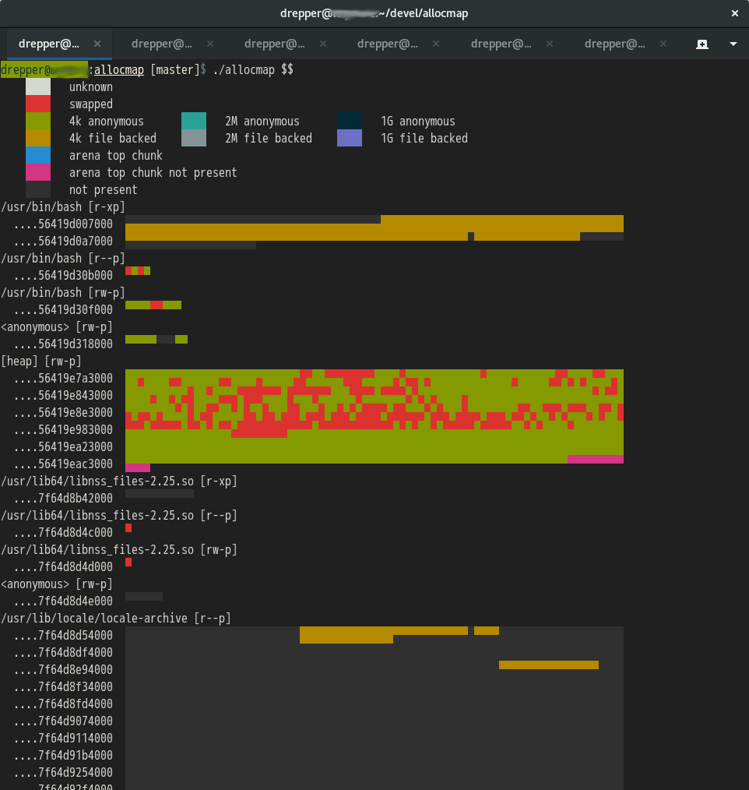
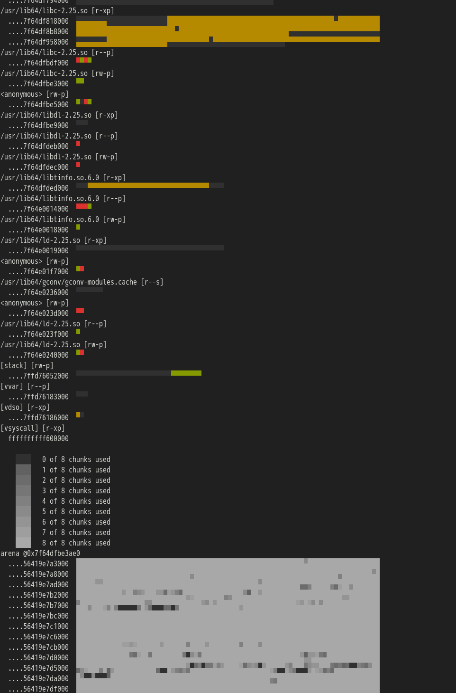

# Display Allocation Map

Getting insight into the memory allocation of a process can be useful for many reasons.
There is only so much information directly available in a human-consumable form.  Mostly,
the Linux kernel provides a the `/proc/`*PID*`/maps` and the `smaps` file to give insight
into the address space of a process.

Additional, more detailed information is available from `/proc/`*PID*`/pagemap`.  This pseudo-file's
content is in binary form and requires decoding.  It allows to discover details such as whether a
given memory page is resident or not and if yes, whether it is anonymous memory or backed by a file.
Additional information even allows to identify the physical memory address which then can be used to
discover additional information.

Beyond this information the kernel can provide the internal memory handling of a process is interesting.
In particular, how the process administrates dynamically allocated memory.  The heap memory allocated
through the `malloc` interfaces playes a crucial part in the performance of a program.

## `pagealloc`

The `pagealloc` program can display this information in a detailed way.  Per memory page information
is provided for each memory region with allocated memory.  Different colors are used to indicate the
different states of the pages.

In addition, the program provides detailed information about the heaps.  The allocation of memory thtough
the `malloc` functions happens in multiple of a size which is usually twice the size of a pointer.  The
output of `pagealloc` shows for each such memory block in the heap whether it is currently used or not.

## Representation

Since I am much more familiar with writing console code than graphical applications the output of
`pagealloc` is based on text.  A Unicode-enabled console is sufficient.  To enable showing the information
with sufficient density each row of characters shows two times 80 values.  Through appropriate use of
the Unicode characters two "pixels" can be represented in one character.

The memory map information as color-coded with the legend printed at the top as it can be seen in the following
screenshot.  Each "pixel" represents one page, normally 4096 bytes.  Each row represents 80 times 4096 bytes,
each line of characters 160 times 4096 bytes, 655360 bytes = 0xa0000.

The heap information is presented with a much higher resolution.  For a x86-64 machine each pixel represents
16 bytes.  One row of characters therefore would show information only for 2560 bytes.  To increase the density
each pixel can have one of nine possible values corresponding to how many of eight consecutive memory chunks
is in use.  The resulting gray-scale picture gives a good indication of memory holes.

# Implementation

The implementation only has the basic implementation details of the malloc implementation hardcoded, namely,
how to locate the memory regions (arenas) and in it the blocks which are free.  The details about the
data types involved are read from the debug information of the program.  On Fedora systems it is trivial
to use `debuginfo-install` to make the necessary files for the C library available.

A modern C++ compiler is needed to compile the code.  The only tested platform in the moment is Fedora 26
on a x86-64 machine.  This means gcc 7.2.1.
